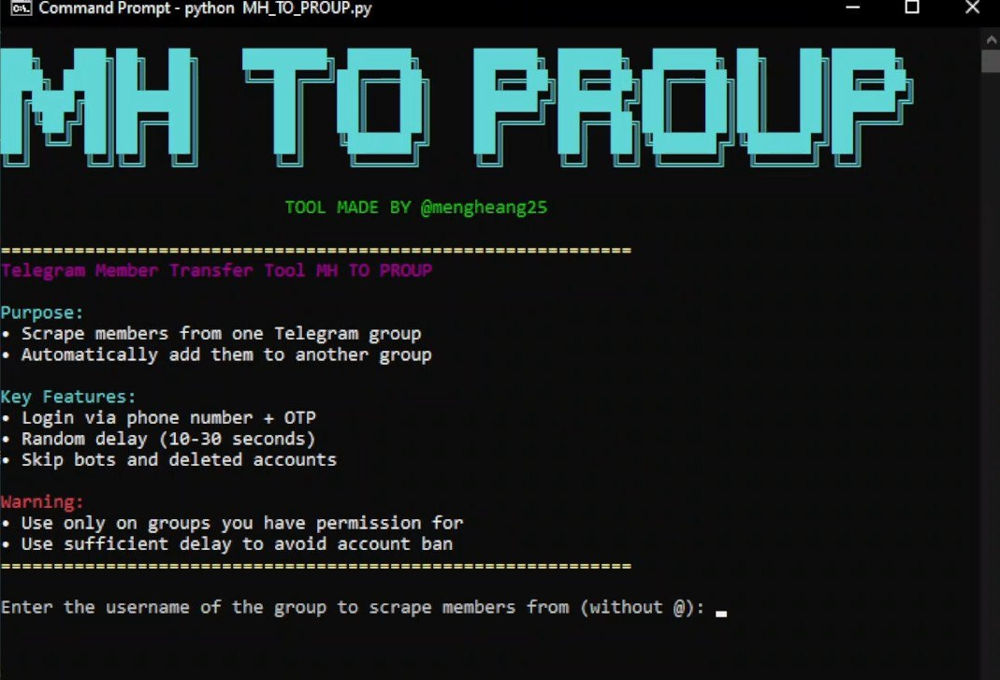

# MH_TO_PROUP

<p align="center">
  
</p>

## 📌 Project Overview
**MH_TO_PROUP** គឺជា Telegram Member Transfer Tool ដែលបង្កើតដោយប្រើ **Python + Telethon**។
Tool នេះអនុញ្ញាតឱ្យអ្នក scrape (យក) members ពី Telegram group មួយ ហើយ add ទៅកាន់ group មួយទៀតដោយស្វ័យប្រវត្តិ។

Tool នេះត្រូវបានរៀបចំសម្រាប់ **Public Release** ក្នុងគោលបំណងសិក្សា, research និង automation testing ប៉ុណ្ណោះ។

---

## ✨ Key Features
- Login តាម Phone Number + OTP
- Support 2FA Password
- Skip bot accounts & deleted accounts
- Random delay (10–30 seconds) ដើម្បីកាត់បន្ថយ ban risk
- Display colored output (CLI)

---


## ⚙️ Requirements (ទូទៅ)
- Python 3.8+
- Telegram account (គ្មាន ban)
- Telegram API ID & API HASH

### Python Modules
```bash
pip install telethon
```

---

## 🔑 Telegram API Setup
1. ចូល https://my.telegram.org
2. Login ដោយ Telegram account
3. ចុច **API development tools**
4. Copy:
   - `api_id`
   - `api_hash`
5. ដាក់ value ទាំងនេះក្នុង code:
```python
api_id = YOUR_API_ID
api_hash = 'YOUR_API_HASH'
```

---

# 🖥️ Usage Guide (By Platform)

## 🐉 Kali Linux

### 1️⃣ Install Python & Pip
```bash
sudo apt update
sudo apt install python3 python3-pip -y
```

### 2️⃣ Clone Project
```bash
git clone https://github.com/mengheangkh/MH_TO_PROUP.git
cd MH_TO_PROUP
```

### 3️⃣ Install Dependencies
```bash
pip3 install telethon
```

### 4️⃣ Run Tool
```bash
python3 MH_TO_PROUP.py
```

---

## 🪟 Windows

### 1️⃣ Install Python
- Download: https://www.python.org/downloads/
- ✅ Tick **Add Python to PATH**

### 2️⃣ Open CMD / PowerShell
```cmd
git clone https://github.com/mengheangkh/MH_TO_PROUP.git
cd MH_TO_PROUP
pip install telethon
python MH_TO_PROUP.py
```

---

## 📱 Termux (Android)

### 1️⃣ Update Termux
```bash
pkg update && pkg upgrade
```

### 2️⃣ Install Python & Git
```bash
pkg install python git -y
```

### 3️⃣ Clone & Install
```bash
git clone https://github.com/mengheangkh/MH_TO_PROUP.git
cd MH_TO_PROUP
pip install telethon
```

### 4️⃣ Run
```bash
python MH_TO_PROUP.py
```

> ⚠️ Termux IP ងាយ Flood — សូមប្រើ delay ធំ (20–40s)

---

## 🍎 iPhone (iOS)

> iOS មិនអាច run Python ដោយផ្ទាល់បាន ❌

### Option 1️⃣: Using **iSH Shell** (Recommended)
1. Download **iSH** from App Store
2. Open iSH → Install python
```sh
apk add python3 py3-pip git
```
3. Clone project
```sh
git clone https://github.com/mengheangkh/MH_TO_PROUP.git
cd MH_TO_PROUP
pip install telethon
python MH_TO_PROUP.py
```

### Option 2️⃣: Remote Server (Best)
- Rent VPS / Cloud Server
- SSH from iPhone using:
  - Termius
  - JuiceSSH

---

## 🚀 How Tool Works
1. Login Telegram (OTP / 2FA)
2. Input:
   - Source group username
   - Target group username
3. Tool scrapes members
4. Add members one-by-one
5. Random delay (10–30s)

---

## ⚠️ Important Warnings
- ❌ Add too fast = BAN
- ❌ Add users without permission = REPORT
- ❌ New account = HIGH RISK

### ✅ Best Practice
- Use old account (1–2 years)
- Add ≤ 30–50 users / day
- Increase delay if FloodWait

---

## 👤 Author
- **Meng Heang**
- Telegram: @mengheang25
- GitHub: https://github.com/mengheangkh

---

## ⚠️ LEGAL DISCLAIMER (IMPORTANT)

❗ **សូមអានឲ្យបានច្បាស់ មុនប្រើ Tool នេះ** ❗

Tool **MH_TO_PROUP** ត្រូវបានបង្កើតឡើងសម្រាប់ **Educational & Research Purposes ONLY**។

- 🚫 មិនមានគោលបំណងជួយ spam, scam ឬ abuse Telegram
- 🚫 មិនលើកទឹកចិត្តការបំពាន Terms of Service របស់ Telegram
- 🚫 មិនគួរប្រើលើ group ដែលអ្នក **មិនមាន permission**

👤 អ្នកប្រើប្រាស់ត្រូវទទួលខុសត្រូវ **100%** ចំពោះការប្រើប្រាស់ Tool នេះ៖
- Account ban / limitation
- Legal issues
- Report / abuse complaints

👨‍💻 Author **មិនទទួលខុសត្រូវ** ចំពោះការខូចខាត ឬបញ្ហាណាមួយ ដែលកើតឡើងពីការប្រើ Tool នេះឡើយ។

---

## ✅ RESPONSIBLE USAGE GUIDELINES
- ✔️ ប្រើតែ account ចាស់ (≥ 1 ឆ្នាំ)
- ✔️ Add ≤ 30–50 users ក្នុងមួយថ្ងៃ
- ✔️ Delay ≥ 20–40 seconds
- ✔️ ប្រើ VPN / Residential IP ប្រសិនបើចាំបាច់

---

## 👤 Author
- **Meng Heang**
- Telegram: [@mengheang25](https://t.me/mengheang25)
- GitHub: https://github.com/mengheangkh

---

## 📄 License
This project is released for **Educational Purpose Only**.

By using this software, you agree that **YOU are solely responsible** for your actions.

⭐ If you find this project useful, please give it a ⭐ on GitHub

